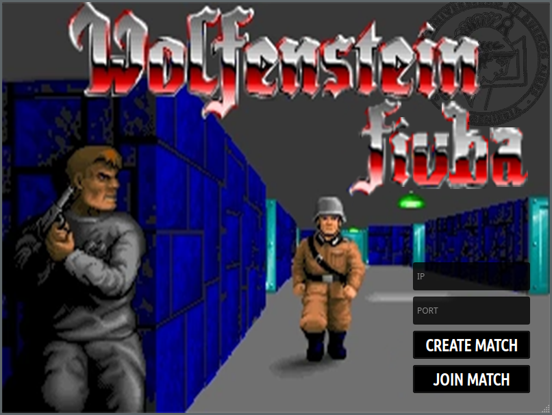
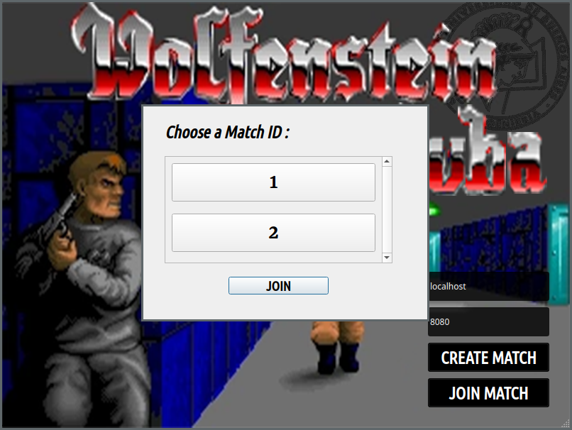
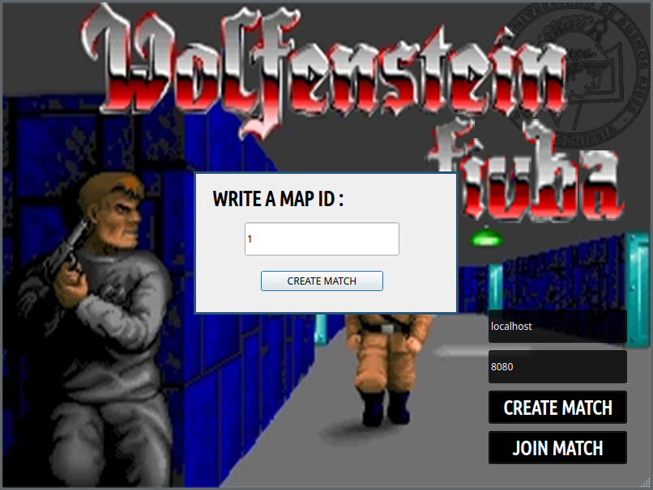
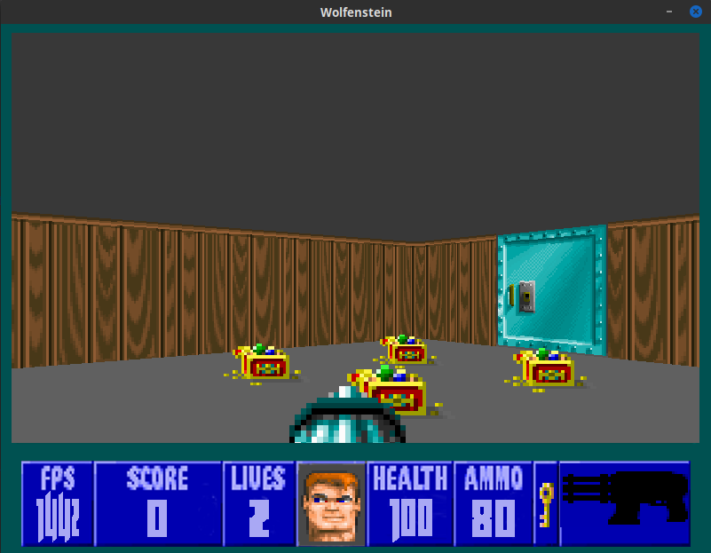
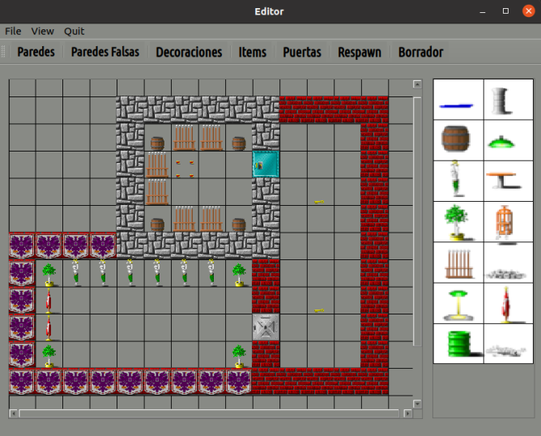

# Taller de Programación I - Cátedra Veiga - FIUBA
# Trabajo Práctico Final

| Padrón | Alumno                    |
|--------|---------------------------|
| 104105 | Jonathan David Rosenblatt |
| 103924 | Joaquín Fontela           |
| 104348 | Joaquin Betz Rivera       |
| 104429 | Thiago Kovnat             |

**Calificación: 10 (diez)**

[Trailer](https://www.youtube.com/embed/ciMsFS47LoA)

# Tabla de Contenidos

- [Guia de Instalacion](#guia-de-instalación)
  - [Requisitos](#requisitos)
  - [Instalación de dependencias](#instalación-de-dependencias)
  - [Configuración, compilación e instalacion de librerias YAML](#configuración,-compilación-e-instalacion-de-librerias-yaml)
- [Forma de Uso](#forma-de-uso)
  - [Servidor](#servidor)
  - [Cliente](#cliente) 
- [Tutorial de Uso](#tutorial-de-uso)
  - [Login](#login)
  - [Iniciar Partida](#iniciar-partida) 
  - [Movimiento](#movimiento)
  - [Armas](#armas) 
  - [Puertas](#puertas) 
    - [Puertas Bloqueadas](#puertas-bloqueadas) 
    - [Puertas Normales](#puertas-normales) 
  - [Drops](#drops)
  - [Editor](#editor) 
- [Apéndice de Errores](#apéndice-de-errores)
  - [Clasificación de Errores](#clasificación-de-errores)

# Guia de Instalación
## Requisitos
Ademas de las librerias que utiliza el juego, el unico otro requisito que necesita el trabajo es contar con una computadora que utilice GNU/Linux como sistema operativo.

## Instalación de dependencias

Dependiendo del gestor de paquetes, el comando para instalar las dependencias puede variar. Sin embargo, los paquetes a instalar son siempre los mismos. A continuación, se deja los comandos para instalar SDL 2.0 y Qt5 para el correcto funcionamiento del trabajo práctico utilizando el gestor de paquetes APT utilizado en muchas distribuciones de Linux.

```
sudo apt-get install libsdl2-dev &&
sudo apt-get install libsdl2-image-dev -y &&
sudo apt-get install libsdl2-mixer-dev -y &&
sudo apt-get install libsdl2-ttf-dev -y &&
sudo apt-get install qt5-default
sudo apt-get install subversion (To download maps from this repository)
```
## Configuración, compilación e instalacion de librerias YAML
Una vez instaladas las dependencias previas, se debe de utilizar el script install.sh brindado en el repositorio para la instalación de la libreria de parsing de YAML y para compilar el trabajo. Dicho script se puede correr utilizando el siguiente comando. Cabe recalcar que se necesitan de derechos de administrador dado que la instalacion de la libreria YAML lo requiere. El instalador deja los recursos del juego en /usr/local/share/Wolfenstein, y los ejecutables en /usr/local/bin.

```
chmod +x install.sh
./install.sh
```

## Forma de Uso

### Servidor
Para ejecutar el servidor, luego de correr el instalador, basta con el comando

```
ServerMain <PORT> 
```

Siendo PORT el puerto a utlizar.

### Cliente
Para correr el cliente, tras correr el instalador, basta con utilizar el comando

```
Wolfen3D
```
### Editor
Para correr el editor, tras correr el instalador, hay que posicionarse en la carpeta qt/editor y ejecutar el siguiente comando
```
./editor
```
Para mover los mapas a la carpeta de los recursos del juego se brinda un script que nos automatiza el proceso, ademas descargando todos los mapas necesarios que se ubiquen en este repositorio. Para ejecutar el script hay que utilizar los siguientes comandos

```
chmod +x fetchmaps.sh

Para descargar mapas oficiales y mover los creados por el usuario a la carpeta de mapas:
./fetchmaps.sh -a

Para descargar unicamente mapas oficiales:
./fetchmaps.sh -d

Para mover unicamente los mapas creados por el usuario a la carpeta de mapas
./fetchmaps.sh -m 

Para ayudas:
./fetchmaps.sh -h

```

# Tutorial de Uso

## Login

Para acceder al login del juego debemos correr `Wolfen3D` en la terminal. El mismo posee dos cajas de texto donde se puede ingresar el host y port.

<br><p align="center"></p>

Luego uno puede seleccionar _Join Match_ si quiere entrar a una partida existente.

<br><p align="center"></p>

O _Create Match_ para crear una propia.

<br><p align="center"></p>

## Iniciar Partida

Una vez creada la partida, ningun jugador podrá moverse o ejecutar ninguna accion hasta que el admin de la partida (aquel que la haya creado) no aprete la tecla _p_ que indica al servidor que el admin desea comenzar la partida.

## Movimiento

Para moverse, se utiliza el sistema clásico de movimiento: _W_ para moverse para adelante, _S_ para moverse hacia atras, _A_ para rotar la camara hacia la izquierda y _D_ para rotar la camara hacia la derecha.

## Armas
Para el uso de las armas, el _enter_ significa disparar mientras que las teclas _1_, _2_, _3_, _4_ y _5_ le permiten al jugador cambiar de armas. El _1_ siempre indica cambiar al cuchillo mientras que el _2_ indica cambiar a la pistola. Las otras 3 teclas le permiten al jugador cambiar a armas que haya agarrado del piso, en el orden en el que las agarró.

<br><p align="center"></p>

Esta arma es el RPG, requiere 5 balas por disparo y genera un proyectil visible que genera daño en area desde la zona de impacto. Hay que tener cuidado, ya que tambien puede dañar al usuario.

## Puertas 

El jugador podrá interactuar con las puertas para generar cambios en el mapa. Este puede intentar abrirlas acercándose lo suficiente y aprentándo la _E_. Hay dos tipos de puertas:

### Puertas Bloqueadas

<br><p align="center"></p>

Esta puerta es una puerta bloqueada, requiere de una llave que se puede agarrar del piso para poder ser abierta. Una vez que la puerta se haya abierto una vez con llave, cualquier jugador, tenga llave o no, podrá abrirla.

### Puertas Normales

<br><p align="center"></p>

Esta puerta es desbloqueable en cualquier momento por cualquier jugador, tenga llave o no.

## Drops

<br><p align="center"></p>

El mapa cuenta con drops distribuidos a lo largo del mapa. Estos incluyen: Armas, munición, llaves, tesoros y medikits. Basta con caminar por encima de ellos y, de ser posible, los agarra automaticamente.

<br><p align="center"></p>

Este es el drop de tesoro, da una cantidad importante de puntos cuando se agarra. Darle prioridad a estos para ganar la partida!

## Editor 

<br><p align="center"></p>

El editor es intuitivo y simple. Seleccionar File->New para crear un mapa, File->Open para abrir un mapa existente o File->Save para guardar un mapa creado. Si es la primera vez que se guarda el mapa creado, se pedira un nombre que debera seguir el estandar de nombre: "map" seguido del ID del mapa, que es un numero arbitrario elegido por el usuario. 

Dentro del editor, en la barra superior hay distintas secciones que indican diferentes elementos posicionables: Paredes, Puertas, Items, etc. Basta con clickear la imagen deseada y elegir en que celda del mapa ponerla. El borrador permite elegir una celda y eliminar sus contenidos, mientras que respawn elige posiciones para que los jugadores reaparezcan (***Como minimo, deberá haber 1 punto de respawn***)

# Apéndice de Errores

El sistema puede tener glitches que causen, o no, diferentes tipos de interferencias en la experiencia del usuario. Para notificar esto y para generar un registro de potenciales problemas que aparecen se usa un log de errores.

El mismo, en caso de que se necesite, escribe en el archivo _"wolfenstein.log"_ (ubicado en el mismo directorio donde se encuentra el ejecutable del cliente) la información correspondiente.

Llamando a la macro `LOG(const char* errorMsg)` se llama al método estático de la clase `Log` que recibe el archivo, la función, la línea y `errorMsg` para escribirlos en el log con el formato antes escrito.

## Clasificación de Errores

Los potenciales mensajes de errores que pueden aparecer son:

- `"Error, track not found with code: [CODE NUMBER]"`: Ocurre en el `audiomanager.cpp` cuando no se encuentra el track con el código dado. Para saber que track es el que falla se puede abrir el `clientprotocol.h` en el cliente y buscar el que nombre de archivo con el código dado causa el problema.   

- `"Error, texture already found with code: [CODE NUMBER]"`: Ocurre en el `audiomanager.cpp` al inicializar los audio tracks. Ocurre si se lee el mismo archivo dos veces. Para saber que track es el que falla se puede abrir el `clientprotocol.h` en el cliente y buscar el que nombre de archivo con el código dado causa el problema.   

- `"Error, no missile texture to explode found."`: Si se reporta este error, signfica que no se pudieron encontrar las coordenadas del último frame del misil en el aire. Glitch no fatal.

- `"Error, no hostname and/or port given."`: Error de Lua que ocurre cuando no se pasan los argumentos correspondientes al ejecutable.

- `"Error, cannot add more textures with code: "`: Ocurre cuando se intenta añadir una cantidad de texturas mayor al límite recomendado. Es un error no fatal que puede ser ignorado o arreglado modificando el límite de texturas en `clientprotocol.h` (cambiar la macro `TEXTURE_LIMIT`).

- `"Error, texture not found with code: "`: Ocurre en el `texturemanager.cpp` cuando no se encuentra la imagen con el código dado. Para saber que imagen es el que falla se puede abrir el `clientprotocol.h` en el cliente y buscar el que nombre de archivo con el código dado causa el problema.   

- `"Error, texture already found with code: [CODE NUMBER]"`:  Ocurre en el `texturemanager.cpp` al inicializar las SdlTextures. Ocurre si se lee la misma imagen dos veces. Para saber que archivo es el que falla se puede abrir el `clientprotocol.h` en el cliente y buscar el que nombre de archivo con el código dado causa el problema.   

- `"Error, map not found: [FILE NAME]"`: Sube este error si no se encuentra el .yaml del mapa correspondiente.

- `"Fatal error, the player couldn't be created."`: Surge si la máquina no puede, por la razon que sea, crear dinámicamente una instancia del jugador. Si es ocasionado por una falta de recursos se debería cerrar cualquier proceso que de forma innecesaria coma recursos.

- `"Fatal error, the executer couldn't be created."`: Surge si la máquina no puede, por la razon que sea, crear dinámicamente una instancia del CommandExecuter (responsable de recibir información del server). Si es ocasionado por una falta de recursos se debería cerrar cualquier proceso que de forma innecesaria coma recursos.

- `"Fatal error, the sender couldn't be created."`: Surge si la máquina no puede, por la razon que sea, crear dinámicamente una instancia del CommandSender (responsable de mandar información del server). Si es ocasionado por una falta de recursos se debería cerrar cualquier proceso que de forma innecesaria coma recursos.

- `"Error, can't push a null pointer as a sprite."`: Ocurre si se intenta guardar un sprite nulo. Puede ser la consecuencia de no tener los recursos para crear estas instancias; en tal caso se debería cerrar cualquier proceso que de forma innecesaria tome recursos.

- Cualquier otro tipo de error loggeado es el el resultado de llamar al método `what()` de la excepción que haya finalizado la vida del programa y es fatal.
